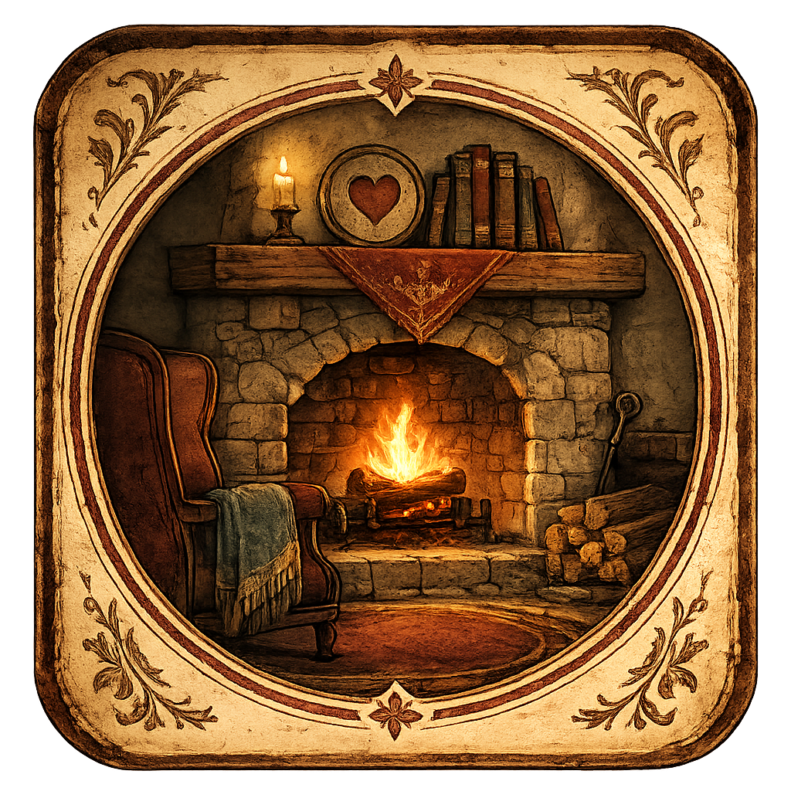
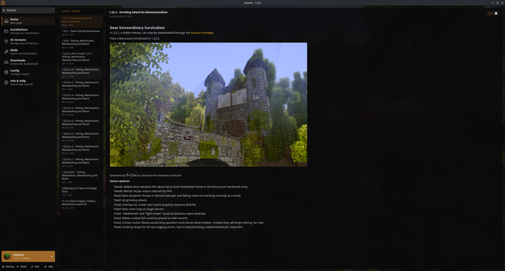
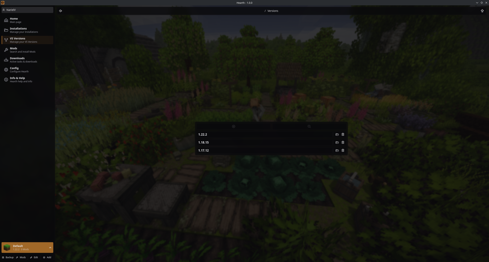
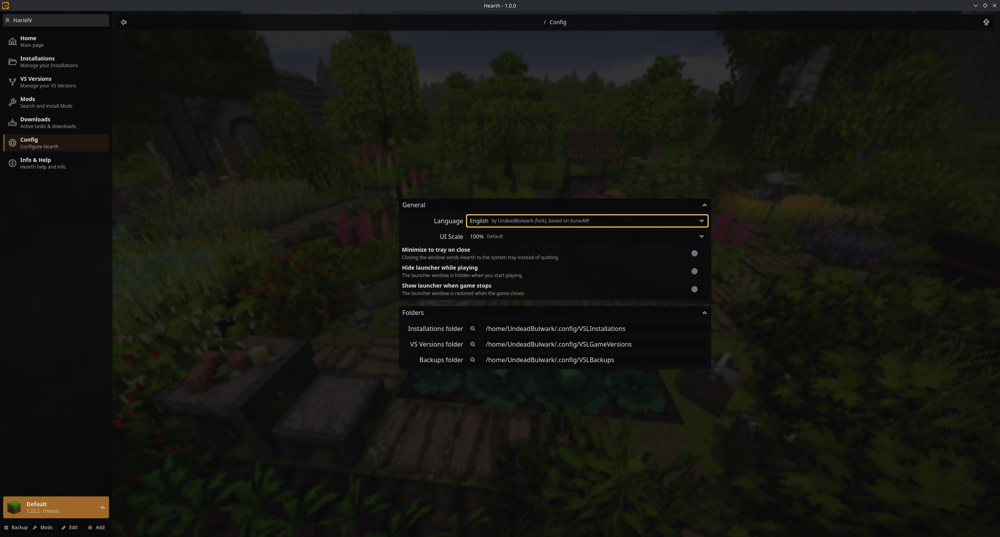

# Hearth

<div align="center">



[](https://github.com/UndeadBulwark/hearth)
[](https://github.com/UndeadBulwark/hearth/issues)
[](https://github.com/UndeadBulwark/hearth/releases)

</div

> A heavily overhauled fork of [**VS Launcher**](https://github.com/XurxoMF/vs-launcher) by [XurxoMF](https://github.com/XurxoMF), rebuilt for multi-account management, a fresh identity, and a better launcher experience for **Vintage Story**.

---

## Screenshots

<div align="center">


*Main launcher interface with installation selector*


*Multi-account dropdown with encrypted session storage*


*Browse and install mods from the Vintage Story ModDB*


*Manage multiple installations with different mods and worlds*


*Configure launcher preferences and game settings*

</div

---

## Fork Notice

This project is a **fork** of the original [VS Launcher](https://github.com/XurxoMF/vs-launcher) created by [XurxoMF](https://github.com/XurxoMF). Full credit goes to XurxoMF and the original contributors for the foundation, design, and core launcher architecture.

**Hearth** takes that foundation and heavily overhauls the experience with:
- **Multi-account management** — save and switch between multiple Vintage Story accounts with session encryption
- **UI refresh** — new icons, branding, and app identity
- **Security improvements** — session tokens encrypted via OS-native `safeStorage`
- **Ongoing feature development** — additional quality-of-life improvements planned

If you love the original VS Launcher, make sure to check it out and support XurxoMF!

---

## Features

Everything you loved from VS Launcher, plus:

- **Multi-Account Support** — Add, switch, and remove multiple Vintage Story accounts with encrypted session storage
- **One-Click Installations & Versions** — Manage multiple game versions and data paths with ease
- **Automatic & Manual Backups** — Protect your worlds, configs, and mods
- **Mod Management** — Browse, install, and update mods directly from the [Vintage Story ModDB](https://mods.vintagestory.at/)
- **Auto-Updater** — Built-in update checking and installation
- **Internationalization** — 14 language locales supported (and growing)
- **Cross-Platform** — Windows, Linux, and macOS support (Linux fully tested)

---

## Installation

Download the latest release for your platform from the [GitHub Releases](https://github.com/UndeadBulwark/hearth/releases) page.

| Platform | Download |
|----------|----------|
| **Linux** | `.AppImage` or `.deb` |
| **Windows** | `.exe` installer |
| **macOS** | `.dmg` (experimental) |

### Linux

1. Download the `.AppImage` from releases.
2. Make it executable: `chmod +x Hearth.AppImage`
3. Run it: `./Hearth.AppImage`

Or install the `.deb` package:
```bash
sudo dpkg -i hearth-*.deb
```

---

## Usage

1. **Launch Hearth.**
2. **Log in** with your Vintage Story account (you can add multiple accounts).
3. **Select an Installation** (or create a new one).
4. **Hit Play!**

For more detailed guides, refer to the original [VS Launcher documentation](https://vsldocs.xurxomf.xyz/get-started/usage) — the core usage remains the same.

---

## Translating

Hearth inherits the i18n system from VS Launcher. If you'd like to contribute translations, open a pull request with your locale file in `src/renderer/src/locales/`.

---

## Support & Issues

- **Bug reports:** [GitHub Issues](https://github.com/UndeadBulwark/hearth/issues)
- **Source code:** [GitHub Repository](https://github.com/UndeadBulwark/hearth)

---

## Credits

- **[XurxoMF](https://github.com/XurxoMF)** — Original creator of VS Launcher and core architecture
- **[UndeadBulwark](https://github.com/UndeadBulwark)** — Fork maintainer, multi-account overhaul, rebranding
- **Contributors** — See the original [VS Launcher contributors page](https://vsldocs.xurxomf.xyz/important-info/contributors)

---

## Disclaimer

Hearth is **not** an official Vintage Story product. It is an **unofficial third-party launcher** for the game. Vintage Story is developed and published by [Anego Studios](https://www.vintagestory.at/).
